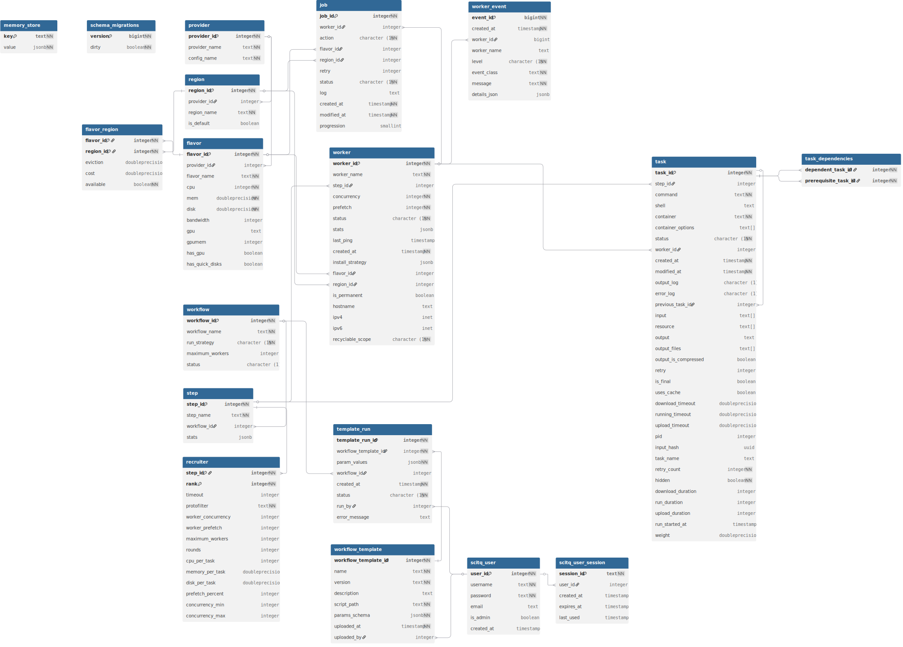

# Model

## SQL Model

scitq uses a PostgreSQL database with the following schema:

(which was produced as described in [Developer notes](dev.md#updating-sql-schema-diagram))

Note for scitq v1 users: while there was no in memory data model in scitq v1 (notably since Python production uses a servlet system, sometimes coined as a "share-nothing" paradigm - e.g., apart from the database, each server process does not talk to its neighbors), there are several things that live in memory in scitq v2, making database modifications unsafe in a general way. With an obvious limit: all the information must be reconstructed from the database when the server starts, but the memory_store table store memory representation (in JSON) that are periodically dumped to the database only to be reloaded at startup.

### task and task_dependencies

These two tables described the tasks scitq have to do. The task table is quite transparent to the Task object in memory. Task statuses are those described in [Developer notes](dev.md#task-state-transitions).

A Task maybe dependent on several other Tasks (or not), which is transcribed in the task_dependencies table. A Task with dependencies always starts in `W` (waiting) status, and will only upgrade to `P` (pending) when all its dependencies have reached the `S` (success) status.

There's an implicit rule in scitq code: a task becomes read only once it has failed or succeeded. Even as soon as it is assigned, nothing that can change the task behavior (command, container, language, inputs, etc.) can be changed (since once the worker has received the task, it does not depend on the server as to when to run it). Thus when a retry occurs, it is not by modifying the task entry, but by creating a clone of the task, and hiding the task, using the `hidden` field, and making the clone point to its source task through the `previous_task_id` field. In this case, the `task_dependencies` are all moved to the clone.

Note: in scitq v1, there was an execution table that differentiated a task run from a task to do (that could be executed several times). During scitq v1, more and more field from task were progressively copied to execution, causing a lot of duplicate information. This specific organization also required a lot of sophisticated queries: scitq v2 simplified schema is a lot easier to handle.

#### output_log and error_log

Output logs and error logs respectively correspond to Unix command stdout and stderr. If you are unfamiliar with stdout/stderr (and stdin), I recommend reading this [Shell scripting lesson](https://www.learnlinux.org.za/courses/build/shell-scripting/ch01s04.html).

The important part for scitq is that, for performance reason, these flow are not copied to the database, but to a separate store, e.g., `scitq.log_root` in the [configuration](reference/configuration.md). The field `output_log` and `error_log` contains merely the status of the log file for this task (notably to handle compression in a future release).

### worker, job and worker_event

The role of scitq server is primarily to assign tasks to workers. The worker table is thus a primary table. It contains lots of information on the worker, with the exception of its physical descriptors such as CPU, memory, disks, which are stored in the flavor table which we'll see below, for the reason that these are likely repeated since it's usual to have different workers with similar features (notably from providers such as Azure or OVH).

`job` may sound like a `task` but it stores things the server has to do and monitor (so long running processes) yet unrelated to tasks. Today, this is restricted to workers: when a new worker is required from a provider, the `worker` object is created in the database, and a job is launched, a go routine that will contact the provider and create the real worker. As explained in [UI](usage/ui.md#job-component), workers are deployed in two phases, the job object mainly considers the provider phase (and the status of a job only reflects that part), the auto-install phase from the worker is only transcribed in the progression percentage of the job.

`worker_event` is a log event from the worker scitq client engine (so not something related to the tasks itself), which could be an issue when deploying (notably in auto-install phase, but also during runtime).

### provider, region, flavor and flavor_region

Workers are deployed from Providers. Providers exist simultaneously in the configuration and in the database. There is a synchronization system during the server startup.

A `provider` in scitq is derived from a provider class, followed by a configuration name, which this scheme:

`<provider class>.<configuration name>`

The reason for this is that there are different situations in which several configurations maybe needed for the same provider (what is called in Azure a subscription): maybe there some subscriptions are paid for in different ways, some are restricted but with discounts (spot), etc. We have different ideas of all the different uses it could have in the future: it already works but we do not use it yet ourselves (we have only one configuration per provider in production).

For now, there are 4 classes of providers:
- Azure: the Microsoft Cloud system,
- Openstack: an open-source cloud system (used only for OVH in scitq for now),
- Local: the "local" provider, that's you! All manually deployed workers belong to this provider, with a unique configuration allowed, the "local" configuration, so a single provider called "local.local" (it may have several regions, though, see below).
- Fake: a fake provider used for integration tests. Don't use it. It works but it will kill your server quite surely if you try anything harsh. 

The only way to add a provider is by modifying the configuration and restarting scitq server.

`region` are attached to providers and are defined in the configuration file. They are regional entities for providers, generally linked to a geographical region (such as `northeurope` (Netherlands) for Azure, or `GRA11` (Graveline City, in France) for OVH). They are defined in the "regions" field of provider configuration paragraph, but are generally inferred from the "quotas" subparagraph (in which case regions can be omitted).

`flavor` are instance descriptions (the term is borrowed from Openstack). They are automatically updated using some configuration settings in provider configuration settings (mainly update_periodicity which is specified in minutes, but also using some provider custom config for Openstack - OVH does not completely follow the standard on that score). For the `local` provider class, each worker reports its own flavor.

`flavor_region` is a many-to-many relation table linking `region` and `flavor` adorned with some custom fields, such as price or eviction rate (which are sometimes specific to regions).

### workflow, step and recruiter

`step`s are classes for `task`s: each task belongs to a step (which can be the NULL step if its step_id is NULL). Only a worker belonging to the same step as the task can be assigned to this task (once again even if the worker is attached to the NULL step).

While in the [DSL](usage/dsl.md), there are several constraints applied to Step and the Task they contain, in the model design, there are few. The different tasks of a step can be very different. The real constraints come from the next object, the `recruiter` which is attached to the step. You cannot attach a recruiter to the NULL step.

`recruiter`s are objects that automatize worker deployment for a given step. See [CLI](usage/cli.md#recruiter-create) for details. They define the rules which command how many workers must be obtained (either by recycling idle workers or deploying new workers from some provider), and what `flavor` is to be used, using a filter expression - explained in the CLI also - something like `cpu>=32:mem>=64`, and also how many tasks of this kind these workers will be able to handle simultaneously (e.g., the concurrency setting, ideally defined using dynamic concurrency, something explained in CLI as well).

This is what makes a step consistent: **the different tasks in a step must share the same CPU/memory/disk requirements**. If not, it will not be possible to design an efficient recruiter. 

`workflow` are just groups of steps. They are used to graphically regroup steps in the UI. They also serve as a common ground for workers, e.g., worker recruited for a certain step in a workflow are by default available to other steps in the same workflow when they become underused. This is called "recycling" and is prohibited by default across workflows (to avoid that some user (involuntarily) steals workers from another).

### template_run, workflow_template, scitq_user and scitq_user_session

`workflow_template`s represent the [DSL](usage/dsl.md) scripts, e.g., python script designed to create `workflow`s. The code itself is stored in a file in the folder defined in the `scitq.script_root` setting of the configuration, so the `workflow_template` object is shallow and used mostly for display in [CLI](usage/cli.md#template) and [UI](usage/ui.md#template-page).

`template_run`s represent the different runs of each `workflow_template` which may be launched lots of times. They also make the relation between the `workflow_template`s and the `workflow` they created. They are also linked to users, a.k.a. `scitq_user`s.

`scitq_user`s represent the users. They may be admin or not. One of the admin (the base one) is defined in the configuration `scitq.admin_user`. This specific user is synced at the server startup. The others can be defined using the [UI](usage/ui.md#user-interface) or the [CLI](usage/cli.md#user-create) (and are managed in the database only). There is a last user who has no name and is implicitly declared in the configuration (`scitq.worker_token`), the user used by workers, this one is not synced in the database and stays in memory.

`scitq_user_session`s represent the user sessions. It holds their token which is reused in cookies for the UI or in the shell environment (in `SCITQ_TOKEN` variable) for the CLI.

### memory_store and schema_migration

These two tables are unlinked to anything. These are technical tables. The schema_migration table is used to manage SQL migrations. The memory_store is used to store in memory objects managed in the go code so that they can be restored at startup. It is best avoided whenever an existing object can be used, and is currently unused (but has been in the past).

## In Memory Model

As explained previously, these are transitionary objects that derive from the SQL model (otherwise they are lost when server restart). They mostly involve periodical actions.

### The Watchdog

Since scitq can deploy workers for you, it can have a strong impact on provider costs (cloud provider mistakes can have dire costs). To avoid paying for useless workers, the watchdog looks for idle workers and... kills them. In doubt of the workers’ usefulness, it... kills them. 

The watchdog is a server top-level go routine and is largely independent of the rest of the server, it reads its settings from the configuration during server startups and does its routine autonomously. The only way to stop it or change its behavior is to stop the server itself.

It has the following settings:

| Configuration item   | Default settings | Description |
| -------------------- | ---------------- | ----------- |
| `scitq.idle_timeout` | 300              | The interval in seconds after which a worker will consider idle (and killed). This timer is launched when the worker has 0 active tasks (no tasks accepted since the last one ended, success or failure). It is reset as soon as the worker accept a new task. With one exception, the case of a new worker which benefits a longer delay. |
| `scitq.new_worker_idle_timeout` | 900   | This is the same as above but only apply for a worker that has never worked. |

The `scitq.new_worker_idle_timeout` also apply for a failing deployment: in some cases (in happens with Azure), the worker deployment may take... forever, or a very long time. It may also fail entirely, but operationally failing or taking forever is not much different. So if the deployment reaches the delay defined by this timeout, the watchdog will kill the worker. While it saves a little money (you generally do not pay for not-operational workers), it will save the overall efficiency. Imagine if all workers take forever to deploy, nothing would happen.

The timers are not saved in the database, when the watchdog restart, it gives workers the benefit of doubt: if they don't have active tasks (which shows in the database), then it (re)starts their idle timer at startup.

### The updater

The updater is in charge of updating providers available flavors. It is set up using the `update_periodicity` setting (an integer in minutes) that is found in most provider classes (see above). Its frequency depends on your usage, but we recommend a relatively high frequency, something like 10 to 30 minutes:
- high frequency covers best dynamic situations like flavor availability when there is tension in the provider's regions you use (which may happen more in discounted plans), together with flavor availability you may have variations in price or eviction (eviction is the likeliness of a worker’s defection),
- it can degrade performances if you update too much (if you have lots of provider configurations with lots of regions and a too-high frequency).

### The quota monitor

The quota monitor does not work periodically but on demand. It just sums up the different items (CPU and Memory) that are consumed when deploying from a provider. 

Almost all providers have quotas (that are negotiable). They are often expressed in CPU, but scitq can use both Memory and CPU quotas. It will prevent the job manager from triggering orders that will fail and can also be used to limit scitq usage so as to create a reserve pool for another usage. 

Each provider configuration quota monitor is autonomous and is managed using the `providers.<providerclass>.<providerconfiguration>.quotas` setting in the configuration.

Each time the server restart, the quota monitor recount current usage from the database.

