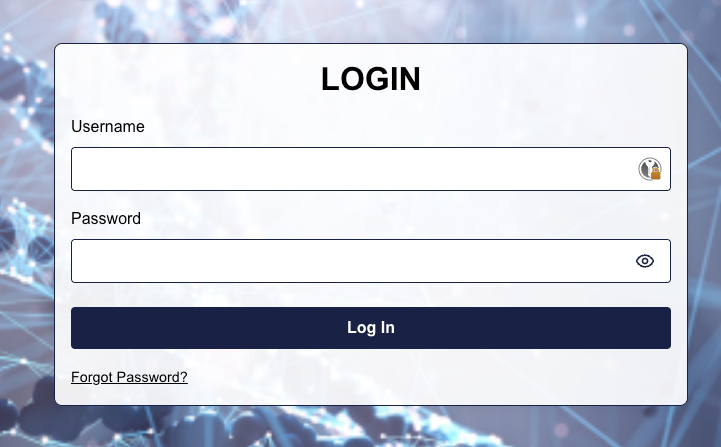

# User Interface

scitq UI (User Interface) is written in [Svelte.js](https://svelte.js). Technically, it is compiled from Svelte (which is broadly speaking a language on top of Typescript) by Node.js during the build phase (which is why Node.js is needed to build) into a static archive with Javascript parts embedded into scitq-server binary. Because the archive is static, Node.js is not needed at runtime. As a user, you can safely ignore this information.

To use the UI, you have to redirect your browser to the name specified in `scitq.server_fqdn` setting in `scitq.yaml`. If it does not work though the server is running, it's likely a network or firewall issue, and a small test with `nmap -sT <my.server.fqdn> -p443` will tell you if the service is open (from the machine where the access fails). 

If it works you should see the login screen.

## Login

Login with the admin user and password if you are the admin (the one specified in `scitq.yaml`), you will be able to create other users from there. 
NB: the password in `scitq.yaml` is encoded, you must remember the original non encoded one (or replace it with a new one).

Once you log in, you arrive at the dashboard.

## Dashboard

The dashboard is split in 3 components:
- on top: the worker components which list the worker,
- on the bottom left: the job components which list jobs, e.g. internal scitq tasks on worker,
- on the bottom right: the create worker component.

On the very top part is the task bar that list the total number of tasks for the most important statuses.

### Worker component

The worker component enables you to see the overall worker load and adjust it.

- (1) will redirect you to the task list for this worker, see below,
- (2) [NOT WORKING YET] enables to change the step of the worker,
- (3) enables you to adjust manually the concurrency level for the worker, the concurrency being the number of task of the kind associated with the step the worker can execute simultaneously, 
- (4) enables you to adjust manually the prefetch level for the worker, that is the number of tasks the worker prepare in advance so that they are ready when a new execution slot becomes available,
- (5) enables you different actions on this worker:
  -  pause the worker, it stops launching new tasks until you unpause it. If you pause it too long, the watchdog, which look for lazy workers, will kill it.
  -  [NOT WORKING YET] restart the worker,
  -  display disk usage and network usage history curves,
  - [NOT WORKING YET] recover maximum available space,
  -  Delete the worker (unless this is a permanent worker)
  -  Display additionnal stats (network/disk IO rates) for the worker

