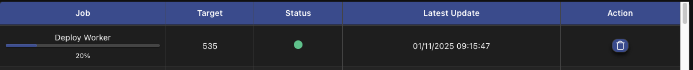

# User Interface

scitq UI (User Interface) is written in [Svelte.js](https://svelte.js). Technically, it is compiled from Svelte (which is broadly speaking a language on top of typescript) by Node.js during the build phase (which is why Node.js is needed to build) into a static archive with JavaScript parts embedded into scitq-server binary. Because the archive is static, Node.js is not needed at runtime. As a user, you can safely ignore this information.

Svelte split the interface in pages, and pages are composed of several components: the description of the UI will follow this logic.

To use the UI, you have to redirect your browser to the name specified in `scitq.server_fqdn` setting in `scitq.yaml`. If it does not work though the server is running, it's likely a network or firewall issue, and a small test with `nmap -sT <my.server.fqdn> -p443` will tell you if the service is open (from the machine where the access fails). 

If it works you should see the login page.

## Login


Login with the admin user and password if you are the admin (the one specified in `scitq.yaml`), you will be able to create other users from there. 
NB: the password in `scitq.yaml` is encoded, you must remember the original non-encoded one (or replace it with a new one).

Once you log in, you arrive at the dashboard.

## Dashboard


The dashboard page is split in 3 components:
- on top: the worker components which list the worker,
- on the bottom left: the job components which list jobs, e.g. internal scitq tasks on worker,
- on the bottom right: the create worker component.

On the very top part is the task bar that lists the total number of tasks for the most important statuses.

### Worker component


The worker component enables you to see the overall worker load and adjust it.

- (1) will redirect you to the task list for this worker, see below,
- (2) [NOT WORKING YET] enables to change the step of the worker,
- (3) enables you to adjust the concurrency level for the worker manually, the concurrency being the number of tasks of the kind associated with the step the worker can execute simultaneously, 
- (4) enables you to adjust the prefetch level for the worker manually, that is the number of tasks the worker prepare in advance so that they are ready when a new execution slot becomes available,
- (5) enables different actions on this worker:
  -  pause the worker, it stops launching new tasks until you unpause it. If you pause it too long, the watchdog, which looks for lazy workers, will kill it.
  -  [NOT WORKING YET] restart the worker,
  -  display disk usage and network usage history curves,
  - [NOT WORKING YET] recover maximum available space,
  -  Delete the worker (unless this is a permanent worker)
  -  Display additional stats (network/disk IO rates) for the worker

The other columns in this dashboard display the number of tasks associated with their different status, as well as worker resources' consumption rate. The CPU column may have a second red number in addition to the main white one, this second figure is the IOwait percentage. This indicator (also present in Unix top command) reflects the proportion of CPU cycles lost due to input/output (IO) congestion, essentially disk or network IO. It is not displayed when below 1% but usually getting above 1% quickly deteriorate the overall performance. 10% IOwait means the real CPU usage (in white) drops below 10% and the worker is almost stuck. It is not too bad if this happens only for a very short time, but it generally means the worker is overloaded and you should consider reducing the concurrence setting or switch to a more adapted kind of worker. 

### Job component


Jobs are internal server tasks dedicated to workers. There are two kinds, Deploy and Destroy. The target is the worker _id which is used in the worker name for workers deployed this way.

The Job component is designed as a monitor for jobs. You can follow jobs, remove a terminated job or restart a failed job. Don't delete a worker by deleting its running job, use the worker component and delete the worker (it will stop the deploy job if it is not over).

When a new job is launched, you instantly see the corresponding worker above in the worker component and the ongoing job below:


A progression bar with a percentage is displayed, with the blue dot indicating a running job. The worker has the installing status (orange dot).

A scitq deploy job has two phases, the server based phase and the worker based phase:
- during the server phase, scitq is sending the creation order, waiting for the provider answer,
- when the creation order succeeds, the worker instance becomes active, download scitq-client from the server, and launch it in install mode. This is the deploy worker phase: scitq-client adjust the configuration of the new worker (installing docker, preparing additional disks, etc.). 

The colored dot reflects the status of the deploy server phase: thus when the progression bar reaches approximately 20%, it turns green for success but the deploy is not over yet, the worker phase continues:



When the bar reaches 100%, it is removed.

If a job fails, a recycle icon  will appear to enable the restarting of the job:


NB: this is a relatively rare event, but it will happen from time to time with azure (because we use spot ?), in which case the safest course is to delete the worker and create a new one rather than restarting the deploy job. Destroy jobs never fail (but for duplicate destroys).

There is a specific process within scitq-server, called the watchdog, that looks for idle workers. It allows for different idle periods (see [configuration](../reference/configuration.md)), but invariably ends by launching a destroy job if it thinks the worker is idle. So a partially deployed worker that does not reach its running state in a reasonable amount of time will automatically be destroyed, in order to avoid useless costs. If you use [recruiters](cli.md#recruiter-create), a new deploy job will be reissued automatically and the whole event is self-healing.

### Create worker component

A create worker order instantly:
- create a new worker object in scitq,
- launch a deploy job for this new worker.


Generally speaking, creating a [recruiter](cli.md#recruiter-create) is a better strategy than creating your workers manually, nevertheless it may help to create a few additional workers manually or to test different types of workers. Look for instance details with the CLI [flavor list](cli.md#flavor-list) command (there are so many flavors for any decent providers, it's really difficult to help that choice graphically).

For the choice in the screen, my command was:
```sh
scitq flavor list --filter 'region~%swed%:eviction<=5'
```
Which gives the (current) cheapest and safe instance in (azure) Sweden region.

The step is not a mandatory setting.

## Task page


The task page is designed to give detailed feedback on each task. Pages are live updated with a low latency. Notably the stdout/stderr column is updated by gRPC streaming. 

There are 4 actions available:
-  Display task details (see below)
-  [UNUSED YET]
-  Restart task
-  [NOT WORKING YET] Hide task

Task details will show additional information as a modal window: container, shell, complete command, and stdout and stderr as separate flow.


Restarting task will hide the previous failed task (the task can still be seen with the [CLI](cli.md#task-list)), and create a copy of the task with the pending status. A worker will need to be assigned to the step of this new task, which is automatic if a recruiter has been used.

## Workflow page


The workflow page gives monitoring possibilities at the upper scale compared to the task page.

 When clicking on the chevron icon, the workflow will open, showing the different steps included with their stats:


You can open as many as you want, the update is live also. Failed tasks display in red, unless they are retried, in which case they show in orange as retried failures. The retried failures (in orange) do not add up to the task total.

For both workflows and steps, the icon  triggers the deletion of the object (and its associated tasks).

## Template page


The template page allows you to run a workflow template or upload a new one. A workflow template or more simply template is a script written in scitq DSL (see [DSL](dsl.md) for details) that create a workflow with its steps and all the tasks. Workflows contain active tasks and are unique. Templates are programs that create complex networks of tasks organized in steps in a single workflow, and thus can be launched a lot of time. 

So for instance, a template might be a program that copies all the part of a website, but copying the https://github.com/scitq/scitq website is a workflow created by this "copy web site" template for the https://github.com/scitq/scitq website, provided as a template parameter.

 The play icon button run the template, it will trigger the display of the template parameters form in a modal window:


Answer all the questions and click run to run the template and create the workflow.


Success or failure, you may get remarks or warnings from the DSL program itself, which may warn you against some issues you might encounter during the workflow.

In case of success a button will provide the possibility to jump to the workflow page for the newly created workflow.

The template page upper form enables you to upload new/updated templates:


Clicking on the `+` button will give you a file selector to select a new DSL file, which upload will be validated by the green check button.


