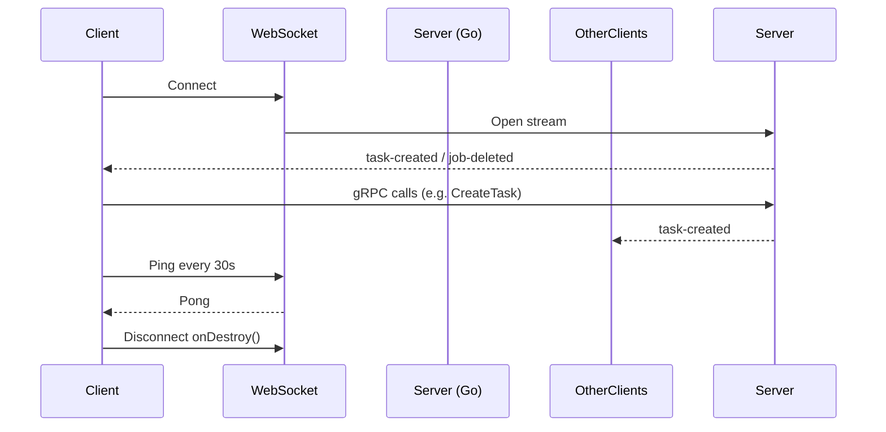

# Svelte + TS + Vite + gRPC with Protobuf

This template helps you quickly get started with a modern frontend stack using **Svelte, TypeScript,** and **Vite,** and integrates a backend using **gRPC** with **Protobuf** for managing worker data.

**Svelte** is a lightweight JavaScript framework that turns components into simple, efficient code during the build process — instead of running complex code in the browser like React or Vue. This makes your app faster and more efficient.

**Vite** is a modern bundler and development server. A bundler is a tool that takes all your source code (like TypeScript, Svelte files, CSS, etc.), combines them, and turns them into files that browsers can read (usually JavaScript and other static files). Vite uses **esbuild** for fast development and **Rollup** for production builds that are optimized for performance.

Together, **Svelte and Vite** provide:
  - Svelte handles building your UI and making it interactive.
  - Vite speeds up the development process and creates optimized, fast builds for production.


## 📁 Project Structure

The project is organized as follows:

ui/
├── gen/
│   ├── taskqueue.ts
│   ├── taskqueue.client.ts
│   └── google/
├── src/
│   ├── assets/
│   ├── components/
│   │   ├── CreateForm.svelte
│   │   ├── CreateUserForm.ts
│   │   ├── LineChart.svelte
│   │   ├── JobsCompo.svelte
│   │   ├── LoginForm.svelte
│   │   ├── Sidebar.svelte
│   │   ├── StepList.svelte
│   │   ├── TaskList.svelte
│   │   ├── UserList.svelte
│   │   ├── WfTemplateList.svelte
│   │   ├── WorkerCompo.svelte
│   │   └── WorkflowList.svelte
│   ├── lib/
│   │   ├── Stores/
│   │   ├── theme.ts
│   │   ├── api.ts
│   │   ├── auth.ts
│   │   └── grpcClient.ts
│   ├── mocks/
│   │   ├── api_mocks.ts
│   │   ├── auth_mock.ts
│   │   └── grpc-web.ts
│   ├── pages/
│   │   ├── Dashboard.svelte
│   │   ├── LoginPage.svelte
│   │   ├── SettingPage.svelte
│   │   ├── TaskPage.svelte
│   │   └── WfTemplatePage.svelte
│   │   └── WorkflowPage.svelte
│   ├── styles/
│   │   ├── createForm.css
│   │   ├── dashboard.css
│   │   ├── jobsCompo.css
│   │   ├── loginForm.css
│   │   ├── loginPage.css
│   │   ├── SettingPage.css
│   │   ├── tasks.css
│   │   ├── userList.css
│   │   ├── worker.css
│   │   └── workflow.css
│   ├── Test/
│   ├── App.svelte
│   ├── main.ts
│   ├── app.ts
│   └── setupTests.css
├── index.html
└── package.json

> 📝 Notes:
> - The `gen/` folder contains TypeScript files generated from the `.proto` definitions.
> - `index.html`, `app.css`, and config files like `package.json` and `tsconfig.json` are located at the project root (`ui/`).
> - `styles/` only contains component-specific styles. The global `app.css` is at the root.

## Installation and Setup

### Prerequisites

Before you start, ensure you have the following tools installed:

- **Node.js** (version 16 or higher)
- **gRPC, Protobuf tools and Protoc (Protocol Buffers compiler)** to generate TypeScript files from `.proto` files.

### 🛠 Development Setup

1. Clone the project.
```bash
git clone https://github.com/scitq/scitq
cd ui
```

2. Install the dependencies:
```bash
npm install
```

3. Start the project in development mode:
```bash
npm run dev
```
This starts the Vite server, which will automatically refresh the app in the browser as you make changes.

### 📦 Production Build
To prepare the app for production:

NB: this is now partly obsolete, production build is included in Makefile so you can compile it specifically with `make ui-build` or if you simply `make install` the UI will be embedded in the server binary. In production, the client is served by a simple Go HTTP server bundle in the server, so once it is loaded in your browser in can contact the gRPCweb server (also embedded in the server) which acts as a proxy to the gRPC server that the main server implement.

1. Build the optimized frontend:
```bash
npm run build
```

1. Preview the production build (optional):
```bash
npm run preview
```
This will show you how the final app will look when deployed, so you can check everything before going live.

> Vite uses **Rollup** in production to make the app smaller and faster by removing unused code.

### Generating TypeScript files from the .proto files:

This project uses gRPC and Protobuf for communication between the frontend and the backend. The .proto files define the structure of the messages and services used. From these definitions, you can automatically generate TypeScript files that are directly usable in the project.

#### ⚙️ Installing protoc
To generate the TypeScript files, you need to install the Protocol Buffers compiler (protoc) on your machine.

1. Download and Install
You can download the latest version of protoc from the official Protocol Buffers GitHub releases page.

Download the archive corresponding to your operating system.
Extract it and add the bin/ directory to your system's PATH environment variable.
```powershell
$env:Path += ";C:\Users\YourName\Downloads\protoc-21.x\bin"
```
```bash
export PATH="$PATH:/home/yourusername/Downloads/protoc-21.x/bin"
```

Then verify the installation:
```bash
protoc --version
```
You should see something like: libprotoc 3.21.x.

#### 📦 Generating the TypeScript Files
Once protoc is installed, the following command will generate the required `.ts` files from your `.proto` definitions:
```bash
npm run gen-proto
```
This script runs:
```bash
protoc \                                                     
  --plugin=protoc-gen-ts=./node_modules/.bin/protoc-gen-ts \
  --ts_out=./gen \
  -I ../proto \
  taskqueue.proto
```
 - `--ts_out ./gen`: Specifies that the generated `.ts` files will be saved in the gen/ folder.
 - `--proto_path=../proto`: Points to the folder containing the `.proto` files.
 - `taskqueue.proto`: The Protobuf file used to describe services like workers and jobs.


The protoc-gen-ts plugin is already included in the project’s dev dependencies, so no extra installation is required.

> 🔄 **Note:** If you change anything in the `.proto` files (like adding or removing messages/services), don’t forget to run `npm run gen-proto` again to regenerate the TypeScript files.

#### 🗂 Output Files
Running the generation command creates two key files in the gen/ directory:
- `taskqueue.ts`: Contains all the TypeScript types for the Protobuf messages (e.g., AddWorkerRequest, ListWorkersResponse).
- `taskqueue.client.ts`: Provides a ready-to-use gRPC client with all service methods (e.g., addWorker(), listWorkers()).

These files can be imported and used directly in the application to interact with the backend via gRPC.

Additionally, if the .proto files use standard types like google.protobuf.Empty, a file like google/protobuf/empty.ts will also be generated automatically.

#### Important Dependencies

The following dependencies are required to enable gRPC and Protobuf integration:
 - `protoc-gen-ts`: Plugin to generate TypeScript types from Protobuf files.
 - `grpc-web`: Library to use gRPC in the browser.
 - `@protobuf-ts/grpcweb-transport`: Transport to handle gRPC requests via the grpc-web protocol.

Here are the main dependencies in your package.json:
```json
"devDependencies": {
  "@tsconfig/svelte": "^5.0.4",
  "protoc-gen-ts": "^0.6.0",
  "typescript": "~5.7.2",
  "vite": "^6.2.0"
},
"dependencies": {
  "@protobuf-ts/grpcweb-transport": "^2.9.6",
  "grpc-web": "^1.5.0",
  "google-protobuf": "^3.21.4"
}
```

## gRPC Client Integration and Communication
Inside the lib/grpcClient/ directory, a utility function is defined to create and configure the gRPC client.
To communicate with the backend services, this project uses **gRPC over HTTP via grpc-web**, allowing a Svelte + Vite frontend to interact seamlessly with a gRPC server — without the need for complex proxy setups.

### 🧠 Understanding the Role of lib/grpcClient
```ts
// src/lib/grpcClient.ts
import { TaskQueueClient } from '../../gen/taskqueue.client'; // Ensure the import path is correct
import { GrpcWebFetchTransport } from '@protobuf-ts/grpcweb-transport';

/**
 * Sets up the gRPC transport layer using GrpcWebFetchTransport.
 * Configured to use the base URL for the backend and include credentials with fetch requests.
 */
const transport = new GrpcWebFetchTransport({
  baseUrl: 'http://localhost:8081',
  fetchInit: { credentials: 'include' },
});

/**
 * Creates an instance of the TaskQueueClient using the configured gRPC transport.
 * This client is used to interact with the TaskQueue gRPC service.
 */
export const client = new TaskQueueClient(transport);
```
This setup uses the @protobuf-ts/grpcweb-transport package to enable communication via gRPC-Web, a protocol that bridges traditional gRPC with browser environments (which don’t support HTTP/2 directly).

> ⚠️ **Important:** The `baseUrl` here (`http://localhost:8081`) corresponds to the gRPC-Web server — not the actual backend server.
>
> Typically, the backend exposes a gRPC server (on a port like `50051`), and a **gRPC-Web proxy server** (such as [Envoy](https://www.envoyproxy.io/) or [grpcwebproxy](https://github.com/improbable-eng/grpc-web)) listens on port `8081` to forward browser requests to it.
>
> This architecture **avoids the need for additional reverse proxies** (like Vite dev proxies), since requests from the frontend go straight to the gRPC-Web server.

### 🚀 Interacting with the gRPC Client via API Functions
In the lib/api.ts file, high-level functions encapsulate the client and expose methods that the UI can call.

These API utilities:
- Encapsulate gRPC calls
- Inject authentication metadata
- Transform raw responses into UI-friendly formats
- Handle errors gracefully

Example – fetching the list of workers:
```ts
import { callOptions } from './auth';
import { client } from './grpcClient';
import * as taskqueue from '../../gen/taskqueue';

/**
 * Retrieves the list of workers.
 * @returns A promise resolving to an array of workers.
 */
export async function getWorkers(): Promise<taskqueue.Worker[]> {
  try {
    const workerUnary = await client.listWorkers(taskqueue.ListWorkersRequest, await callOptionsUserToken());
    return workerUnary.response?.workers || [];
  } catch (error) {
    console.error("Error while retrieving workers:", error);
    return [];
  }
}
```
Here:
- `client` is the preconfigured gRPC client, shared across the app

- `callOptions` includes metadata such as authentication tokens

- `taskqueue.ListWorkersRequest` is a generated request message from your `.proto` definitions

- The response is unpacked and returned in a format suitable for the UI

## 🛠 Features Enabled by gRPC APIs

The API layer (`lib/api.ts`) makes several key features possible:

| Feature                   | Function(s)                                                                                                                                                 | Description                                                                                          |
|---------------------------|-------------------------------------------------------------------------------------------------------------------------------------------------------------|------------------------------------------------------------------------------------------------------|
| 👤 **User Management**     | `changepswd()`, `getListUser()`, `newUser()`, `delUser()`, `forgotPassword()`, `getUser()`, `updateUser()`                                                  | Manage users: create, delete, retrieve, update, and reset passwords                                  |
| 👷 **Worker Management**   | `getWorkers()`, `newWorker()`, `updateWorkerConfig()`, `delWorker()`, `getStatus()`, `getTasksCount()`                                                      | Manage workers: CRUD operations, configuration updates, and status                                   |
| 📋 **Job Management**      | `getJobs()`, `delJob()`, `getJobStatus()`, `getJobStatusClass()`, `getJobStatusText()`                                                                     | Handle jobs: list, delete, retrieve job statuses, and map job status codes to UI                    |
| 🧪 **Flavor Discovery**    | `getFlavors()`                                                                                                                                              | Retrieve available flavors for creating new workers                                                  |
| � **Template Management**  | `getTemplates()`, `UploadTemplates()`, `runTemp()`                                                                                                         | Manage workflow templates: list, upload, and execute templates                                       |
| � **Workflow Management**  | `getWorkFlow()`, `getSteps()`                                                                                                                              | List workflows and their steps                                                                       |
| 🎨 **UI Mapping**          | `getJobStatusClass()`, `getJobStatusText()`, `getWorkerStatusClass()`, `getWorkerStatusText()`                                                            | Convert backend status codes into human-readable labels and CSS classes                             |
| 📊 **Worker Stats**        | `getStats()`, `formatBytesPair()`                                                                                                                           | Retrieve statistics and metrics related to workers                                                   |
| 📋 **Task Management**     | `getAllTasks()`, `getLogsBatch()`, `streamTaskLogsOutput()`, `streamTaskLogsErr()`                                                                         | Retrieve, sort, and filter tasks; stream live logs (stdout/stderr); fetch historical logs           |

These functions use the client generated from the `.proto` file (`taskqueue.client.ts`) and the associated data types (`taskqueue.ts`), making the communication **type-safe**, **predictable**, and **intuitive**.

## 🧩 Components 

| 🧩 Component             | 📝 Description |
|--------------------------|------------------------------------------------------------------------------------------------------------------------------------------|
| 🔨 **createForm.svelte** | Dynamic form to create new workers with interactive auto-complete fields for **provider**, **flavor**, **region**, and **workflow.step**.<br>Fetches flavor and workflow data on `onMount()` and provides a two-column suggestion dropdown for selecting a workflow and its steps.<br>Filters suggestions in real time based on user input.<br>Once submitted, the form calls `newWorker(...)` and sends a `worker + job` object via WebSocket to notify of creation.<br>Includes input validation, error handling, and automatic form reset upon success.<br>**Styles**: `createForm.css` |
| 📋 **jobsCompo.svelte**  | Displays a live-updating list of current and past jobs.<br>Uses `onMount()` to periodically refresh job status and progression every 5 seconds via `getJobStatus(...)`.<br>Jobs are rendered with status badges (`getJobStatusClass()`), progress bars, and action icons (🔁 Restart / 🗑️ Delete).<br>Maintains a reactive `jobStatusMap` to sync latest job info.<br>Emits a `jobId` via `onJobDeleted` when a job is removed.<br>Supports graceful unmounting by clearing the refresh interval.<br>**Styles**: `worker.css`, `jobsCompo.css` |
| 🔐 **loginForm.svelte**  | Simple login form.<br>Uses `getClient().login()` for authentication.<br>Handles loading (`isLoading`) and errors.<br>**Styles**: `loginForm.css` |
| 📚 **Sidebar.svelte**    | Sidebar navigation with dropdowns and icons via lucide-svelte (Dashboard, Tasks, Batch, Settings, Logout).<br>Handles `tasksOpen` for submenus.<br>`isSidebarVisible` and `toggleSidebar()` passed as props.<br>**Styles**: `dashboard.css` |
| 👷 **workerCompo.svelte** | **Enhanced worker dashboard with dual display modes**:<br>📊 **Table Mode**: Classic tabular view with all metrics<br>📈 **Chart Mode**: Visual analytics with:<br>- Real-time **Disk I/O** and **Network I/O** line charts (via `LineChart` component)<br>- Interactive zoom controls (in/out/reset) and auto-zoom<br>- System metrics visualization (CPU, RAM, Load, IOWait)<br>- Disk usage bars with warning thresholds<br><br>**Key Features**:<br>- Toggle between table/chart views<br>- Aggregates metrics across all workers<br>- 30-point history tracking for trend visualization<br>- Responsive design adapts to data intensity<br>- Smart auto-zoom calculates optimal view<br>- Manual zoom override available<br><br>**Data Flow**:<br>- Receives preloaded workers list<br>- Periodically refreshes stats/status (5s interval)<br>- Sends update and deletion notifications via WebSocket<br>**Styles**: `worker.css`, `jobsCompo.css` |
| 📋 **UserList.svelte** | Displays a table of users with columns: Username, Email, Admin status, and Actions.<br>Receives the `users` list as a prop from the parent component (`SettingsPage`).<br>Provides modals for editing user info and resetting passwords.<br>Supports user deletion with confirmation.<br>Uses WebSocket messages to receive user updates, deletions, and password reset confirmations instead of dispatching events.<br>Includes password visibility toggle with `Eye` / `EyeOff` icons<br>**Styles**: `worker.css`, `userList.css` |
| 🆕 **CreateUserForm.svelte** | Form for creating new users.<br>Receives input for username, email, password (with visibility toggle), and admin checkbox.<br>Calls the API to create a user and notifies the parent component (`SettingsPage`) via WebSocket message with the new user data.<br>Supports user deletion via WebSocket.<br>Resets form fields after successful creation.<br>**Styles**: `createForm.css` |
| 📝 **TaskList.svelte**   | Displays all tasks in a detailed table with columns: Task ID, Name, Command, Worker, Workflow, Step, Status, Start, Runtime, Output, Error, Actions.<br>Uses `getJobStatusClass()`, `getJobStatusText()`, and lucide icons for restart, download, delete.<br>Shows a message if no tasks found.<br>**Styles**: `worker.css`, `jobsCompo.css` |
| 📂 **WorkflowList.svelte** | Displays a list of workflows with expandable details.<br>Uses lucide icons for actions (Pause, Reset, Break, Clear).<br>Manages expanded state for workflows.<br>Embeds `StepList` component for detailed step display.<br>Supports workflow deletion via WebSocket messages.<br>**Styles**: (to be added) |
| 📑 **StepList.svelte**     | Shows detailed steps for a given workflow.<br>Fetches steps via `getSteps(workflowId)` on mount.<br>Displays table with step metrics and action buttons.<br>Uses lucide icons for Pause, Reset, Break, Clear.<br>Supports step deletion via WebSocket.<br>**Styles**: `worker.css`, `jobsCompo.css` |
| 📈 **LineChart.svelte**    | **Reusable SVG-based line chart component**<br>Features:<br>- Dual-line visualization with customizable colors<br>- Dynamic stroke width based on zoom intensity<br>- Auto/manual zoom controls<br>- Legend display with real-time values<br>- Total metrics summary<br>- Responsive SVG rendering<br>Used by `workerCompo` for Disk/Network I/O visualization<br>**Props**:<br>- `line1/line2`: Data points arrays<br>- `color1/color2`: Line colors<br>- `title1/title2`: Metric names<br>- `value1/value2`: Current values<br>- `total1/total2`: Aggregate totals<br>- `zoomLevel`: Current zoom factor<br>- `autoZoom`: Auto-scaling toggle<br>**Styles**: Embedded component CSS |

## 📄 Pages

| 📄 Page                  | 📝 Description |
|--------------------------|---------------------------------------------------------------------------------------------------------------------------------------------------------------------------------------------------------------------------------------------------------------------------------------------------------------------------------------------------------------------------------------------------------------------------------------------|
| 🖥️ **Dashboard.svelte** | **Central hub with real-time monitoring and management**<br><br>**Core Features**:<br>- Dual-panel layout (Workers + Jobs)<br>- Infinite scrolling for jobs with chunked loading (25 items per load)<br>- New job notification system with "Show" button<br>- Success message handling with 5s timeout<br>- Comprehensive worker lifecycle management (create/update/delete)<br>- Automatic job creation for worker deletions<br><br>**Data Flow**:<br>- Initial load fetches workers and first job chunk<br>- Scroll-triggered loading of additional jobs<br>- Real-time updates via WebSocket event handlers (`onWorkerAdded`, `handleWorkerUpdated`, `handleWorkerDeleted`)<br><br>**UI Components**:<br>- `WorkerCompo`: Displays and manages workers<br>- `JobCompo`: Shows job list with actions<br>- `CreateForm`: Worker creation form<br>- Smart scroll management maintains position during updates<br><br>**Technical Highlights**:<br>- Scroll direction detection (ignores horizontal scroll)<br>- Position-aware new job insertion (top or notification)<br>- Memory-efficient job loading (chunked requests)<br>- Robust error handling with user feedback<br>**Styles**: `dashboard.css` |
| 🔐 **loginPage.svelte** | Login page with `LoginForm`.<br>Checks for token in `localStorage` and redirects to `/dashboard`.<br>Displays logo and header.<br>**Styles**: `loginPage.css` |
| ⚙️ **SettingPage.svelte** | User and admin settings page.<br>Displays personal profile info and allows password change via modal.<br>Fetches and maintains the full list of users on mount using `getListUser()`, then passes it to `UserList`.<br>If the user is admin: shows `CreateUserForm` and `UserList`.<br>Receives new user data via WebSocket messages and adds it to the local list.<br>Handles user updates, deletions, and password reset confirmations via WebSocket, updating local state and showing success alerts accordingly.<br>**Styles**: `SettingPage.css` |
| 📝 **TaskPage.svelte** | **Advanced task management system**<br><br>**Core Features**:<br>- Real-time task monitoring with 1s auto-refresh<br>- Dynamic filtering (worker/workflow/step/status/command)<br>- URL-synchronized filters via hash parameters<br>- Infinite scroll with 25-task chunks<br>- New task notification system<br>- Comprehensive log streaming (stdout/stderr)<br>- Interactive log modal with pagination (50 logs/chunk)<br><br>**Data Flow**:<br>- Parallel loading of workers/workflows/steps on mount<br>- Dual log streams for running tasks (`streamTaskLogsOutput`, `streamTaskLogsErr`)<br>- Batch loading for completed task logs (`getLogsBatch`)<br>- Smart task deduplication during updates<br><br>**UI Components**:<br>- `TaskList`: Displays filtered tasks with contextual actions<br>- Status filter bar with 13 task states<br>- Searchable command filter with loading state<br>- Modal with auto-scrolling log panels<br><br>**Technical Highlights**:<br>- Scroll position preservation during updates<br>- Memory-optimized log buffers (50-line limit)<br>- Direction-aware infinite loading (top/bottom)<br>- Comprehensive error handling<br>**Styles**: `tasks.css` |
| 🌐 **WorkflowPage.svelte** | **Workflow management with infinite scroll**<br><br>**Core Features**:<br>- Chunked loading (25 workflows per request)<br>- Scroll direction detection (ignores horizontal scroll)<br>- New workflow notification system<br>- Position-aware loading (top/bottom detection)<br><br>**Data Flow**:<br>- Loads workflows on mount and on scroll<br>- Expands workflows to show steps with `StepList` component<br>- Supports workflow deletion via WebSocket messages<br><br>**UI Components**:<br>- `WorkflowList` with expandable details<br>- `StepList` for workflow steps<br><br>**Technical Highlights**:<br>- Efficient event handling for scroll<br>- Seamless user experience with notifications<br>**Styles**: (to be added) |


## 📡 Real-Time Architecture with WebSockets in Svelte
This application uses a **WebSocket-based architecture** to enable **real-time, multi-user communication** between the UI and backend. It replaces traditional client-side event dispatching with **bidirectional streaming**, drastically improving performance and consistency in collaborative environments.

### 💡 Why WebSockets?
Unlike client-triggered actions or periodic sync mechanisms, **WebSockets maintain a persistent channel** between the server and all connected clients. This is essential for features like:

- 🔄 **Live updates** (e.g., job creation, task status, worker state)
- 👥 **Multi-user collaboration** (e.g., multiple admins managing workflows in sync)
- ⚡ **Sub-50ms UI reactivity** without polling or reloading

### 🌍 WebSocket Integration in Svelte
The WebSocket connection is **established once** at app launch and **shared globally** via a store. Each Svelte component can then **subscribe only to relevant message types**, ensuring performance and modularity.
```ts
// wsClient.ts (Store abstraction)
import { writable } from 'svelte/store';

function createWebSocketStore() {
  const { subscribe, set } = writable<WebSocket | null>(null);
  const handlers = new Set<(data: any) => void>();

  function connect() {
    const socket = new WebSocket('ws://localhost:PORT/ws');
    set(socket);

    socket.onmessage = (event) => {
      const message = JSON.parse(event.data);
      handlers.forEach((h) => h(message));
    };

    socket.onclose = () => set(null); // auto-reconnect logic can go here
  }

  function subscribeToMessages(handler) {
    handlers.add(handler);
    return () => handlers.delete(handler);
  }

  return {
    subscribe,
    connect,
    subscribeToMessages
  };
}

export const wsClient = createWebSocketStore();
```

```ts
// wsClient.ts (Store abstraction)
import { writable } from 'svelte/store';

function createWebSocketStore() {
  const { subscribe, set } = writable<WebSocket | null>(null);
  const handlers = new Set<(data: any) => void>();

  function connect() {
    const socket = new WebSocket('ws://localhost:PORT/ws');
    set(socket);

    socket.onmessage = (event) => {
      const message = JSON.parse(event.data);
      handlers.forEach((h) => h(message));
    };

    socket.onclose = () => set(null); // auto-reconnect logic can go here
  }

  function subscribeToMessages(handler) {
    handlers.add(handler);
    return () => handlers.delete(handler);
  }

  return {
    subscribe,
    connect,
    subscribeToMessages
  };
}

export const wsClient = createWebSocketStore();
```
Each component **reacts only to its relevant event types**, making the app **reactive, scalable, and maintainable**.

### 🧠 Key Advantages
| Feature                | Without WebSocket           | With WebSocket                |
| ---------------------- | --------------------------- | ----------------------------- |
| Communication Scope    | Client-triggered only       | Full duplex (server & client) |
| UI State Updates       | Triggered manually          | Pushed instantly from server  |
| Multi-User Consistency | Complex to maintain         | Native and automatic          |
| Latency                | Depends on gRPC roundtrips  | ⚡ < 50ms                      |
| Network Load           | Higher (repeated requests)  | Minimal (one persistent conn) |
| Scalability            | Challenging with many users | Excellent                     |


### ⚙️ WebSocket Lifecycle (Svelte Integration)

- **Ping/Pong** keeps the connection alive
- **Scoped events:** only relevant clients are updated (e.g. no broadcast storm)
- **Reconnect logic:** handled globally or per-component

### 📊 Real-World Performance Benchmarks
| Operation                 | gRPC only (manual fetch) | WebSocket-Based | Improvement  |
| ------------------------- | ------------------------ | --------------- | ------------ |
| Task Creation Visibility  | 300–600ms                | <50ms           | 🚀 6–10x     |
| User Deletion Propagation | Manual refresh           | Instantly shown | ✅ Live       |
| Multi-Admin Sync          | Risk of stale data       | Live and synced | ✅ Seamless   |
| List Refresh Frequency    | Frequent calls           | Not needed      | ✅ Eliminated |


### 🧩 Multi-User Collaboration
Thanks to WebSocket integration, this system supports real-time dashboards where **multiple users** can:
- 📥 See new jobs, tasks, and workers **as they appear**
- 🔄 React to status updates or deletions **instantly**
- ✅ Avoid stale state or manual reloads
- 👨‍🔧 Safely collaborate with **no conflict risk**

This is ideal for **scientific task pipelines, shared admin panels,** and **real-time monitoring** environments.

### 🎯 Targeted Real-Time Messaging with WebSockets
/!\ It seems this whole section is mostly chatGPT chit chat on how should targeted websocket be implemented. But it never made it up to the code.
Current code only makes use of ws.Broadcast().

This section explains how to **send WebSocket updates only to the user who submitted the task** in your current Svelte + Go WebSocket setup, improving efficiency and security by avoiding broadcasting to all clients.

#### 🛠️ Why Targeted Messaging?
- 🚫 Avoid irrelevant messages for other users
- 🎯 Deliver updates **only to the user who created or owns the task**
- 🔒 Improve security by minimizing data exposure
- ⚡ Reduce bandwidth and improve client-side performance

#### 🛠️ Step-by-Step Implementation (Example for Tasks)

##### 1️⃣ Modify `broadcaster.go` (in `websocket/` folder)
**Goal:** Track connected clients with their user IDs (e.g. workerId or clientId) instead of just storing connections.

- Add a new global map to associate **client/user IDs** with their WebSocket connections:
```go
// Add near the top, after `clients` and `mu`
var clientsById = make(map[string]*websocket.Conn)
```
- In the `Handler` function, extract the user ID from the URL query or headers **when the client connects** (for example, a `clientId` param):
```go
clientId := r.URL.Query().Get("clientId")
if clientId == "" {
    log.Printf("Client connected without clientId, rejecting")
    http.Error(w, "clientId is required", http.StatusBadRequest)
    return
}
```
- Then **register the connection with this ID** instead of only tracking the connection:
```go
mu.Lock()
clientsById[clientId] = conn
mu.Unlock()
```
- On connection close, remove the client from the map:
```go
defer func() {
    mu.Lock()
    delete(clientsById, clientId)
    mu.Unlock()
    conn.Close()
}()
```

##### 2️⃣ Create a Helper Function in `broadcaster.go` to Send to a Specific Client
Add this function **inside** `broadcaster.go`, after your existing functions:

```go
func sendToClient(clientId string, message []byte) {
    mu.Lock()
    conn, ok := clientsById[clientId]
    mu.Unlock()

    if !ok {
        log.Printf("Client %s not connected", clientId)
        return
    }
    if err := conn.WriteMessage(websocket.TextMessage, message); err != nil {
        log.Printf("Error sending message to %s: %v", clientId, err)
        conn.Close()
        mu.Lock()
        delete(clientsById, clientId)
        mu.Unlock()
    }
}
```

##### 3️⃣ Update Your Database Schema (SQL Migration)

/!\ This whole paragraph is very surprising, it makes very little sense (using the database is not appropriate at all) and it does not seem applied at all.


Add a `submitted_by` or `client_id` field to the task table to record who submitted the task.
Example SQL:
```sql
ALTER TABLE task ADD COLUMN submitted_by TEXT;
```
Make sure your task creation logic stores the user’s ID here (depends on your backend code, e.g., `INSERT INTO task (...) VALUES (..., submitted_by)`).

##### 4️⃣ Modify Your Task Update Logic (Wherever You Push Updates)
Wherever you currently broadcast task updates (likely inside your gRPC server or update handlers), change to:
- **Query the `submitted_by` user ID** for the updated task

Example in Go (pseudo-code):
```go
var submitterId string
err := db.QueryRowContext(ctx, "SELECT submitted_by FROM task WHERE task_id = $1", taskId).Scan(&submitterId)
if err != nil {
    log.Printf("Failed to get submitter for task %d: %v", taskId, err)
    return
}
```
- Then **send the update only to that client** using the helper function:
```go
messageBytes, _ := json.Marshal(updateMessage)
sendToClient(submitterId, messageBytes)
```

##### 5️⃣ Update Client WebSocket Connection (`wsClient.ts` in your Svelte app)
Modify the `connect()` function to **include the token or clientId in the WebSocket URL query string**:

```ts
import { getToken } from './auth'; // adjust path as needed

function connect() {
  const token = getToken();
  const clientId = extractClientIdFromToken(token); // implement or get userId from JWT claims

  const url = `wss://alpha2.gmt.bio/ws?clientId=${encodeURIComponent(clientId)}&token=${encodeURIComponent(token)}`;
  socket = new WebSocket(url);

  // existing code...
}
```
- This ensures the server can associate each WebSocket connection with the proper user.

##### 6️⃣ Secure WebSocket Connections (Important!)
- **Validate the JWT token on the server** in `broadcaster.go` when the WebSocket connection is established, to confirm the clientId is genuine.
- Use **TLS** (`wss://`) to encrypt the connection and protect tokens.
- Reject connections with invalid or expired tokens.

##### 🚀 Summary Table: What & Where to Change
| Step | File / Folder                              | What to Change                                                                  |
| ---- | ------------------------------------------ | ------------------------------------------------------------------------------- |
| 1    | `websocket/broadcaster.go`                 | Add `clientsById` map, register connections by clientId, remove on close        |
| 2    | `websocket/broadcaster.go`                 | Add `sendToClient(clientId, message)` helper function                           |
| 3    | Database (SQL migration)                   | Add `submitted_by` field to `task` table                                        |
| 4    | Backend gRPC handlers or task update logic | Query `submitted_by` for updated task, call `sendToClient` instead of broadcast |
| 5    | `src/lib/wsClient.ts` (Svelte client)      | Modify WebSocket URL to include `clientId` and `token` query parameters         |
| 6    | `websocket/broadcaster.go`                 | Add JWT token validation on WebSocket connect                                   |

This precise integration will help your app send **real-time updates only to the relevant user**, enhancing security and performance, while keeping your existing codebase clean and modular.

### ✅ Benefits Recap

- 🔁 **True bidirectional communication** (not just user-triggered)
- ⚡ **<50ms end-to-end latency**
- 👥👤 **Flexible real-time support: multi-user broadcasts and targeted single-user updates**  
- 📉 **Minimal network usage**
- 🧼 **Clean abstraction via store + handler pattern**
- 🧠 **Fully decoupled, reactive UI components**

### 🧩 Conclusion
WebSocket integration provides the **reliability, speed, and reactivity** needed for modern apps — especially when combined with **Svelte + Go + gRPC**. Whether you're building **scientific workflows, job queues, or collaborative tools,** this architecture gives you the **infrastructure to scale with confidence**.

## 🧠 App.svelte – Root Component  
Handles login logic:

`isLoggedIn = true` ➜ Dashboard + Sidebar  
`false` ➜ Login Page

`toggleSidebar()` allows toggling the sidebar visibility.

Applies different CSS classes based on the mode (`body-dashboard`, `body-login`).


## 🧩 main.ts – Entry Point

Main file referenced in index.html.
Mounts the App.svelte component inside <div id="app"></div>.

## 🌍 index.html – HTML Entry

Single entry point of the app (Single Page Application).
Loads the main.ts script.

## 🔐 Authentication

This section explains how the authentication flow is implemented in the application.

### Overview

- 🔑 The authentication system uses **cookies** and JWT tokens to manage user sessions.  
- ✔️ A login status boolean is kept in `isLoggedIn`.  
- 🔍 Token presence is checked on mount inside the login page (`loginPage.svelte`).  
- 🔄 If a valid token exists, the user is automatically redirected to the dashboard.

---

| 🔍 Feature               | 📋 Description                                                                                       |
|-------------------------|---------------------------------------------------------------------------------------------------|
| 🛠️ Authentication method | Uses cookies and JWT tokens to manage user sessions securely.                                      |
| ✅ Login status          | Boolean `isLoggedIn` tracks whether the user is authenticated.                                    |
| 🔎 Token validation      | Checked during component mount on the login page (`loginPage.svelte`).                            |
| ↪️ Redirect behavior     | Automatically redirects authenticated users to the dashboard.                                    |
| 🔐 Login flow            | POSTs credentials to `/login`, then fetches JWT token via secure cookie endpoint.                 |
| 🔓 Logout flow           | Calls gRPC logout, clears cookies on the server, and resets token and login status locally.      |
| 📡 Authorization headers | JWT tokens are attached to gRPC calls via metadata for secure authenticated requests.             |

## 🌓 Dark/Light Theme Management
The application features a system-wide dark/light theme toggle with automatic detection based on user preferences.

### 🛠 Implementation
1. Theme Store (`src/lib/Stores/theme.ts`):
- Uses a Svelte writable store to manage the current theme
- Automatically detects preferred theme:
```ts
function initializeTheme() {
  if (typeof window === 'undefined') return 'light';
  
  const savedTheme = localStorage.getItem('theme');
  const systemPrefersDark = window.matchMedia('(prefers-color-scheme: dark)').matches;
  
  return savedTheme || (systemPrefersDark ? 'dark' : 'light');
}
```
1. Theme Persistence:
- Saves user preference in localStorage during session
- Automatically resets to OS preference on logout
- Applies theme via data-theme attribute on <html>
```ts
theme.subscribe(currentTheme => {
  localStorage.setItem('theme', currentTheme);
  document.documentElement.setAttribute('data-theme', currentTheme);
});

// In logout function:
localStorage.removeItem('theme'); // Reset to OS preference next login
```
4. Session Behavior:
- Theme preferences persist during the user session
- On logout:
* Theme preference is cleared from localStorage
* Next login will default to OS preference
* User can set a new preference for the new session

4. CSS Variables (app.css):
- Uses CSS variables for theme-specific colors
- Dark theme overrides light theme variables:
```css
:root {
  /* Light theme variables */
  --primary-color: #192245;
  --bg-primary: #ffffff;
  --text-primary: #213547;
}

[data-theme="dark"] {
  /* Dark theme overrides */
  --primary-color: #3a4b8c;
  --bg-primary: #121212;
  --text-primary: #f0f0f0;
}
```

### 🔄 Theme Switching
Toggle the theme in `sidebar.svelte` available anywhere in your app:
```ts
  function toggleTheme() {
    theme.update(current => current === 'dark' ? 'light' : 'dark');
  }
```
```svelte
<button on:click={toggleTheme} class="theme-toggle" title="Toggle theme">
  {#if $theme === 'dark'}
    <SunMoon class="theme-icon" color="#fbbf24" />
  {:else}
    <SunMoon class="theme-icon" color="#9ca3af" />
  {/if}
</button>
```

### 🎨 Theming Components
Component styles automatically adapt using CSS variables:
```css
/* In component CSS */
.my-component {
  background-color: var(--bg-primary);
  color: var(--text-primary);
}
```
The system provides:
- Automatic OS preference detection
- Persistent user preference during session
- Clean reset on logout
- Smooth transitions between themes
- Easy theming of new components


## 🔗 Libs & Dependencies

- `svelte`: Main UI framework (v5+)
- `vite`: Build tool and development server
- `lucide-svelte`: Icon library using Lucide SVGs
- `grpc-web`: Enables gRPC in the browser
- `google-protobuf`: JS runtime for protobuf types
- `@protobuf-ts/plugin`: Protobuf → TypeScript generator
- `@protobuf-ts/grpcweb-transport`: gRPC-Web transport layer
- `protoc-gen-ts`: CLI for generating TS from `.proto` files
- `rxjs`: Reactive utilities for async data
- `typedoc`: Generates documentation from TS comments
- `dotenv`: Loads env variables from `.env` file
- `svelte-check`: Type-checking and diagnostics for Svelte
- `@types/google-protobuf`: TypeScript types for `google-protobuf`

> These dependencies enable a full-featured Svelte app with type-safe gRPC communication, rich icon support, and automated documentation.

## 🚀 Testing

This project includes both **unit tests** and **integration tests** to ensure the functionality, reliability, and correct interaction of components and pages.

### Testing Frameworks
We use **Vitest** for running tests and **Testing Library** for component rendering and user interaction simulation.

### Mock Setup
To simplify mocking, all mocked API and auth functions are centralized in the `src/types/mocks` directory:  
- `src/types/mocks/api_mock.ts`  
- `src/types/mocks/auth_mock.ts`  

These mocks are globally applied in `src/setupTests.ts` with additional theme support:

```ts
// src/setupTests.ts
import '@testing-library/jest-dom';
import { vi } from 'vitest';
import { mockApi } from './mocks/api_mock';
import { mockAuth } from './mocks/auth_mock';

// Mock gRPC
vi.mock('grpc-web', () => ({ grpc: {} }));

// Mock window.matchMedia for theme detection
if (typeof window !== 'undefined' && !window.matchMedia) {
  window.matchMedia = vi.fn().mockImplementation((query) => ({
    matches: query === '(prefers-color-scheme: dark)', // Default to dark mode in tests
    media: query,
    onchange: null,
    addEventListener: vi.fn(),
    removeEventListener: vi.fn(),
    addListener: vi.fn(), // legacy support
    removeListener: vi.fn(),
    dispatchEvent: vi.fn(),
  }));
}

// Global mocks for API and Auth modules
vi.mock('../lib/api', () => mockApi);
vi.mock('../lib/auth', () => mockAuth);

// Silence console errors and logs during tests
vi.spyOn(console, 'error').mockImplementation(() => {});
vi.spyOn(console, 'log').mockImplementation(() => {});
```
In individual test files, you simply import `mockApi` to redefine or spy on specific API function behaviors as needed:
```ts
import { mockApi } from '../mocks/api_mock';
vi.mock('../lib/api', () => mockApi);
```

### 🧪 Testing with a Mocked WebSocket
To simulate WebSocket messages in your tests, you mock `wsClient.subscribeToMessages` and capture the message handler callback provided by your component.

**1. Mock Setup (`src/setupTests.ts`)**
```ts
vi.mock('@/lib/wsClient', () => ({
  wsClient: {
    connect: vi.fn(),
    disconnect: vi.fn(),
    subscribeToMessages: vi.fn(() => () => true), // returns an unsubscribe function
  },
}));
```

**2. Capture and Use the `messageHandler` in Tests**
```ts
import { wsClient } from '../lib/wsClient';

let messageHandler: (msg: any) => void;

beforeEach(() => {
  vi.spyOn(wsClient, 'subscribeToMessages').mockImplementation((handler) => {
    messageHandler = handler; // store the handler to use later
    return () => true; // unsubscribe function
  });
});

// In a test:
messageHandler?.({
  type: 'user-created',
  payload: { userId: 4, username: 'newuser' }
});
```

**3. Benefits**
- No need for a real WebSocket server.
- Full control over when and what messages are sent.
- Tests only your component’s reaction to WebSocket events.

### Theme Testing Support
The test setup includes:
- Mock for window.matchMedia to simulate OS theme preferences
- Default dark mode preference in test environment
- Support for testing theme-related functionality

To test theme-dependent components:
```ts
  it('should switch between light and dark modes', async () => {
    const { getByTestId } = render(App);
    const toggle = getByTestId("theme-button");
    
    // Initial state (dark mode from mock)
    expect(document.documentElement.getAttribute('data-theme')).toBe('dark');
    
    // Click to toggle
    await fireEvent.click(toggle);
    expect(document.documentElement.getAttribute('data-theme')).toBe('light');
  });
```

### Running Tests
To run the tests, follow these steps:

1. Install dependencies if you haven’t already:
```bash
npm install
```
2. Run the tests with the following command:
```bash
npx vitest
```

### Test Structure
All tests reside in the `src/tests` directory, with one file per feature or component, to maintain modularity and clarity.

### Types of Tests

| 🧩 Type                  |  📝 Description                                                                                                                                       |
| --------------------- | ---------------------------------------------------------------------------------------------------------------------------------------------- |
| ✅ **Unit Tests**        | Verify individual components and utility functions in isolation.<br>Mocks API calls to test internal logic and component behavior.             |
| 🔁 **Integration Tests** | Validate interaction between multiple components/pages and user workflows.<br>Simulate real user scenarios including navigation and data flow. |

#### Example Unit Test: WorkerCompo Component
This test verifies that the component correctly displays a list of workers, using the centralized mock API.
```ts
import { render, waitFor } from '@testing-library/svelte';
import WorkerCompo from '../components/WorkerCompo.svelte';
import { describe, it, expect, vi } from 'vitest';
import { mockApi } from '../types/mocks/api_mock';

vi.mock('../lib/api', () => mockApi);

const mockWorkers = [
  { workerId: 'w1', workerName: 'Worker One' },
  { workerId: 'w2', workerName: 'Worker Two' }
];

const mockStats = {
  totalWorkers: 2,
  activeWorkers: 1,
};

describe('WorkerCompo', () => {
  it('should display the list of workers', async () => {
    (mockApi.getWorkers as any).mockResolvedValue(mockWorkers);
    (mockApi.getStats as any).mockResolvedValue(mockStats);

    const { getByText } = render(WorkerCompo, { props: { workers: mockWorkers } });

    await waitFor(() => {
      expect(getByText('Worker One')).toBeTruthy();
    });
  });
});
```

#### Example Integration Test
This test simulates user interaction navigating from the main app to the Settings page, verifying the page rendering and UI updates.
```ts
import { render, fireEvent, waitFor } from '@testing-library/svelte';
import App from '../App.svelte';

it('should display Setting page when clicking "Settings" in the ToolBar', async () => {
  const { getByTestId, getByText, queryByText } = render(App);

  // Wait for dashboard content to appear after login
  await waitFor(() => {
    expect(queryByText('Settings')).toBeInTheDocument();
  });

  // Click the "Settings" button
  const settingsButton = getByText('Settings');
  await fireEvent.click(settingsButton);

  // Wait for the Settings page to be displayed
  await waitFor(() => {
    expect(getByTestId('settings-page')).toBeInTheDocument();
  });
});
```
### 📂 Test Files Overview

| 🧪 Test File               | 🧪 Type(s) of Tests Included        |
|---------------------------|-------------------------------------|
| `CreateForm.test.ts`      | Unit                                |
| `CreateUserForm.test.ts`  | Unit                                |
| `dashboard.test.ts`       | Integration                         |
| `JobsCompo.test.ts`       | Unit                                |
| `LoginPage.test.ts`       | Unit + Integration                  |
| `Navigation.test.ts`      | Integration                         |
| `SettingPage.test.ts`     | Unit + Integration                  |
| `StepList.test.ts`        | Unit                                |
| `TaskList.test.ts`        | Unit                                |
| `TaskPage.test.ts`        | Integration                         |
| `UserList.test.ts`        | Unit                                |
| `WebSocket.test.ts`       | Unit                                |
| `WfTemplateList.test.ts`  | Unit                                |
| `WfTemplatePage.test.ts`  | Integration                         |
| `WorkerCompo.test.ts`     | Unit                                |
| `WorkflowList.test.ts`    | Unit                                |
| `WorkflowPage.test.ts`    | Integration                         |


> **Note:**
> **- Unit tests focus on isolated components and functions.<br>**
> **- Integration tests verify that multiple parts work together correctly and simulate real user behavior.<br>**
> **- You can expand this table as you add more test files.**

## 🚀 Production & Security Overview

### 🔐 HTTPS & Certificates Setup
- Your Go server runs on **port 443**, the standard HTTPS port.
- TLS certificates (e.g. from Let’s Encrypt) must be specified in your server config so your app can serve HTTPS properly and be trusted by browsers.
- In your frontend Vite config, you load these same certs to enable **HTTPS on the dev server** (port 5173) with a valid certificate, preventing browser trust issues during development:
```ts
// vite.config.ts snippet
server: {
  https: {
    key: fs.readFileSync(path.resolve(__dirname, '../certs/privkey.pem')),
    cert: fs.readFileSync(path.resolve(__dirname, '../certs/fullchain.pem')),
  },
  host: 'alpha2.gmt.bio',
  port: 5173,
}
```
- Using self-signed or invalid certs breaks browser trust and blocks connections. Let’s Encrypt or other CA-issued certs fix this.
- The server handles CORS and HTTPS termination internally — **no nginx reverse proxy is used** currently, as traffic levels remain manageable.

### 🛠️ Production Deployment Steps: Frontend (Svelte + Vite)
1. Certs must be present in `../certs` folder or wherever you configured.
2. Vite dev server configured with HTTPS using those certs allows secure local development.
3. For production, build your frontend assets:
```bash
npm run build
```
4. Deploy the built static files (usually in `dist/`) to your production server or CDN.
5. Your Go server’s static file handler serves these files over HTTPS (already set up).
6. Access your app securely via `https://<serverFQDN>`.

### 🧰 About the HTTP mux & gRPC-Web
- Your HTTP mux handles static files, gRPC endpoints, and gRPC-Web requests all in one unified HTTPS server on port 443.
- No extra steps needed in production for mux config — it is already production-ready and supports TLS, CORS, and fallback routing.
- The mux middleware sets strict CORS headers to allow only your frontend domain.
- gRPC-Web wrapper inside mux transparently upgrades requests to gRPC protocol.

| Step             | Server-side                                  | Frontend (Svelte + Vite)                |
| ---------------- | -------------------------------------------- | --------------------------------------- |
| TLS certificates | Configure in config, use Let’s Encrypt certs | Use same certs in Vite dev HTTPS config |
| HTTPS port       | Listen on 443                                | Dev on 5173 HTTPS                       |
| Build            | Already built                                | `npm run build`                         |
| Run              | Run binary with config on 443                | Serve static files from Go server       |
| CORS             | Configured in Go mux                         | Access frontend securely via HTTPS      |
| Reverse proxy    | Not used, unnecessary for now                | Not applicable                          |


## Conclusion

This documentation helps you understand how to set up and use Svelte + Vite with a gRPC backend based on Protobuf. It covers the project structure, the TypeScript file generation tool, and how to manage gRPC services to interact with the server.
